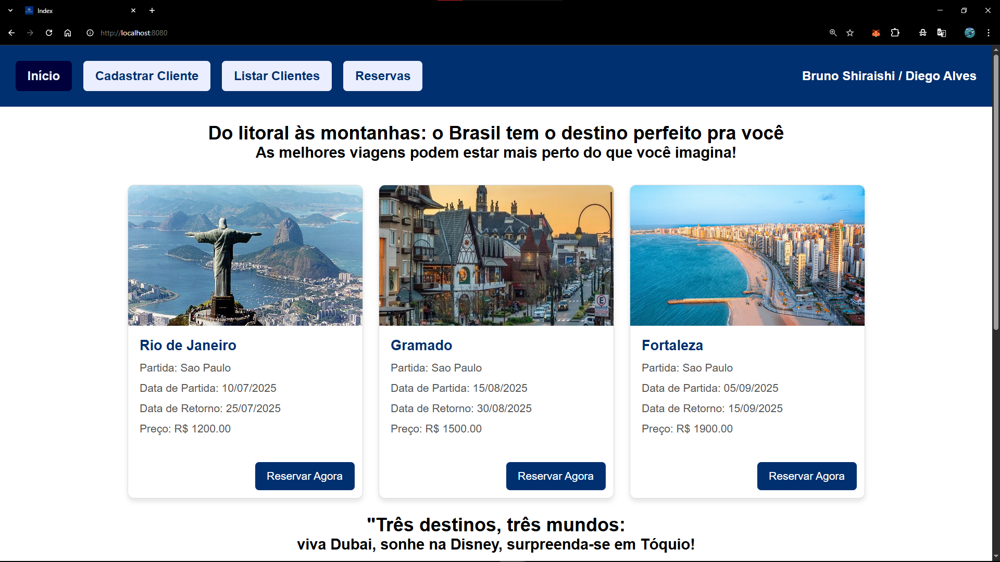
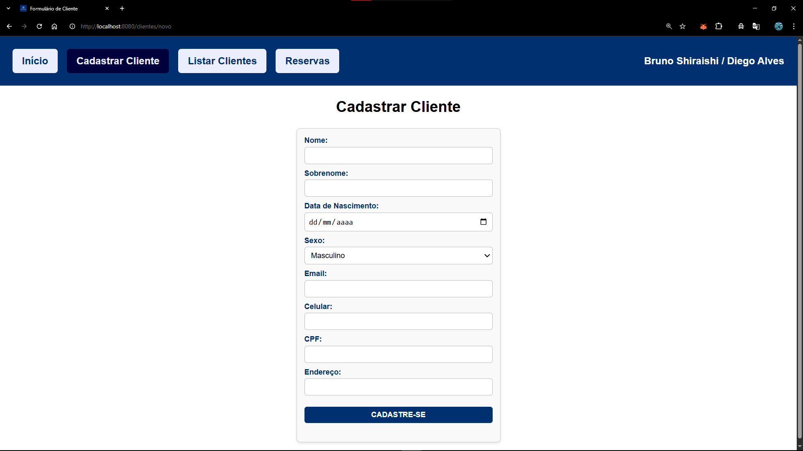
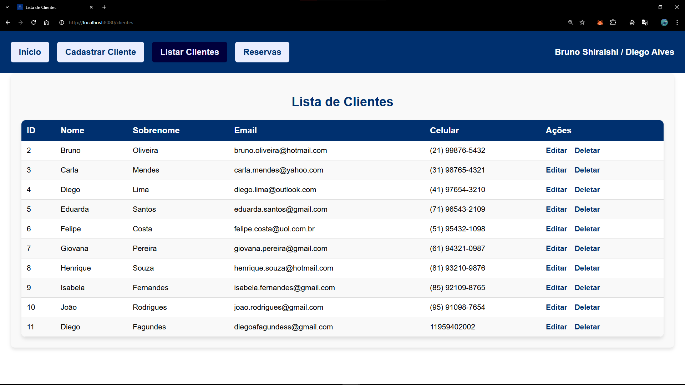
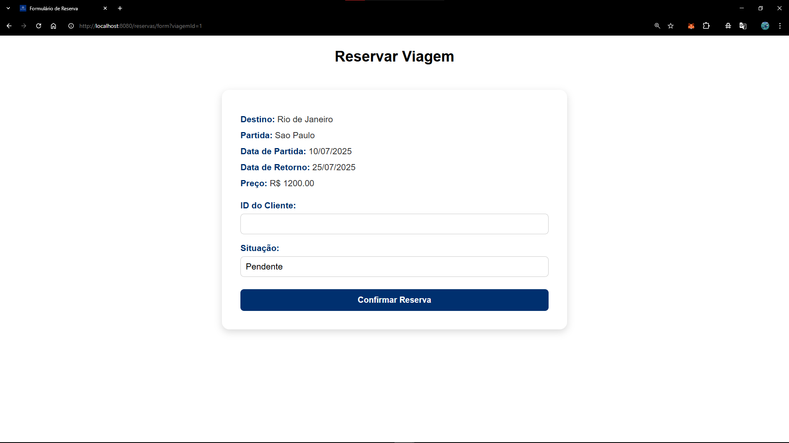
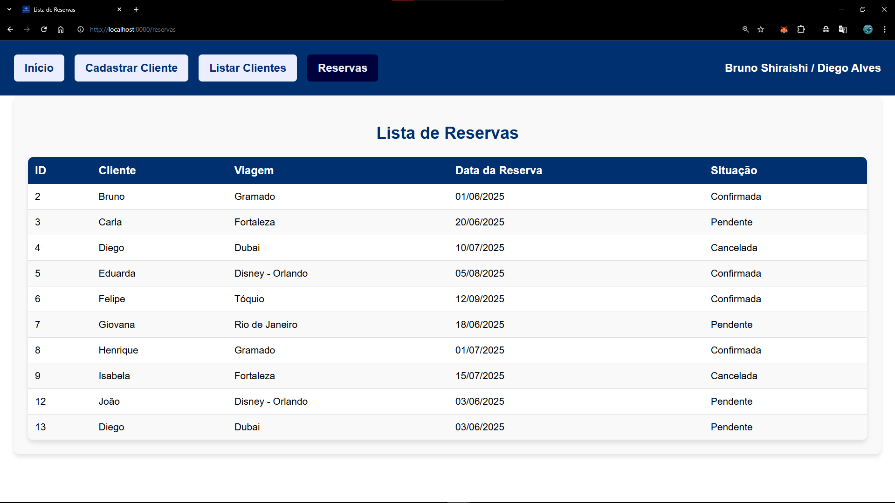

# 🧳 B&D Viagens

## 📌 Descrição

**B&D Viagens** é uma aplicação web para gerenciamento de uma agência de viagens, permitindo o cadastro de clientes, viagens disponíveis e a criação de reservas.  
O sistema foi desenvolvido como projeto acadêmico utilizando **Java**, **Spring Boot**, **Thymeleaf** e **MySQL**, com aplicação dos padrões de projeto GoF e arquitetura MVC.

---

## 🚀 Tecnologias Utilizadas

- Java 17  
- Spring Boot  
- Thymeleaf  
- MySQL  
- Maven  

---

## ⚙️ Pré-requisitos

Certifique-se de ter instalado:

- Java 17 ou superior  
- Maven  
- MySQL  
- IDE como IntelliJ IDEA ou VS Code com extensão Java  

---

## 🛠️ Como executar o projeto

### 1. Clonar o repositório

```bash
git clone https://github.com/Diego251Fagundes/B-D-Viagens.git
cd B-D-Viagens
```

### 2. Configurar o banco de dados

Crie um banco de dados MySQL chamado `agencia_viagens`.

Execute o script SQL localizado em:

```
src/main/BancoDados
```

### 3. Configurar o `application.properties`

Edite o arquivo em `src/main/resources/application.properties`:

```properties
spring.datasource.url=jdbc:mysql://localhost:3306/agencia_viagens
spring.datasource.username=SEU_USUARIO
spring.datasource.password=SUA_SENHA
spring.jpa.hibernate.ddl-auto=update
spring.jpa.show-sql=true

spring.thymeleaf.prefix=classpath:/templates/
spring.thymeleaf.suffix=.html
spring.thymeleaf.cache=false

```

### 4. Compilar e executar o projeto

```bash
mvn clean install
mvn spring-boot:run
```

### 5. Acessar no navegador

Acesse:

```
http://localhost:8080
```

---

## 🗃️ Estrutura de Pastas

```
src/
├── main/
│   ├── java/
│   │   └── bd/viagens/
│   │       ├── controller/      # Controllers MVC
│   │       ├── dao/             # Repositórios (Spring Data JPA)
│   │       ├── model/           # Entidades e Builders/Factories
│   │       ├── command/         # Padrão Command
│   │       └── facade/          # Padrão Facade
│   ├── resources/
│   │   ├── static/              # CSS, JS, imagens
│   │   ├── templates/           # HTML com Thymeleaf
│   │   └── application.properties
│   └── BancoDados               # Script de criação do banco
```

---

## 🧾 Entidades do Banco de Dados

- **Cliente**: id, nome, sobrenome, data de nascimento, sexo, e-mail, celular, cpf, endereço.
- **Viagem**: id, destino, local de partida, data de ida/volta, preço.
- **Reserva**: associação entre Cliente e Viagem, data da reserva e situação.

---

## 📬 Autores

Bruno Hideo Silva Shiraishi.

Diego Alves da Silva Fagundes.

---
## **Screenshots**

- **Tela Inicial:**


- **Tela de cadastro do Cliente:**


- **Lista de Clientes Cadastrados:**


- **Tela de Reservar:**


- **Lista de Reservas Cadastradas:**

